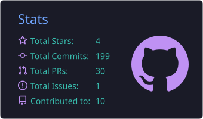
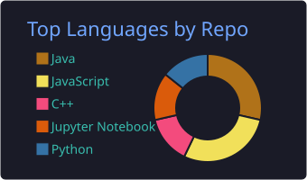
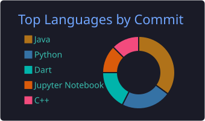
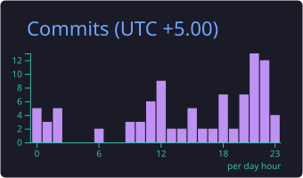

<!-- Header banner -->
<div align="center">


<a href="https://git.io/typing-svg">
  
</a>

<br/>

[](https://www.linkedin.com/in/chanduka-lakshan/)
[](mailto:chandukalakshanbttdm@gmail.com)
[](https://github.com/hclperera?tab=followers)


</div>

---

## 👋 About Me

I'm an **Information Technology undergraduate at RUSL** who enjoys turning ideas into working software. I like solving problems with code, digging into how systems work under the hood, and picking up new tools along the way.

```yaml
name: Chanduka Lakshan
role: IT Undergraduate | Developer
studying: Information Technology @ RUSL
currently_learning: [Linux Fundamentals, DevOps]
interests: [Linux Systems, DevOps, Mobile Apps, Open Source, Problem Solving]
open_to: Collaboration on interesting projects
philosophy: teamwork + communication = success 🚀
```

---

## 🛠️ Tech Stack

**Languages**

<p>
  
</p>

**Web & Data**

<p>
  
</p>

**Tools, Libraries & DevOps**

<p>
  
</p>


---

## 🎯 Currently

- 🌱 Learning **Linux fundamentals**
- 🐳 Exploring **DevOps** tooling (Docker, Kubernetes)
- 🤝 Looking for **collaborations** and open-source projects to contribute to

---

## 📊 GitHub Stats

<div align="center">






</div>

---

## 📫 Let's Connect

I'm always happy to chat about projects, Linux, DevOps or anything tech. Reach out on [LinkedIn](https://www.linkedin.com/in/chanduka-lakshan/) or drop me an [email](mailto:chandukalakshanbttdm@gmail.com).

<div align="center">

<sub>⭐ If you like something you see here, a star on a repo goes a long way.</sub>


</div>
